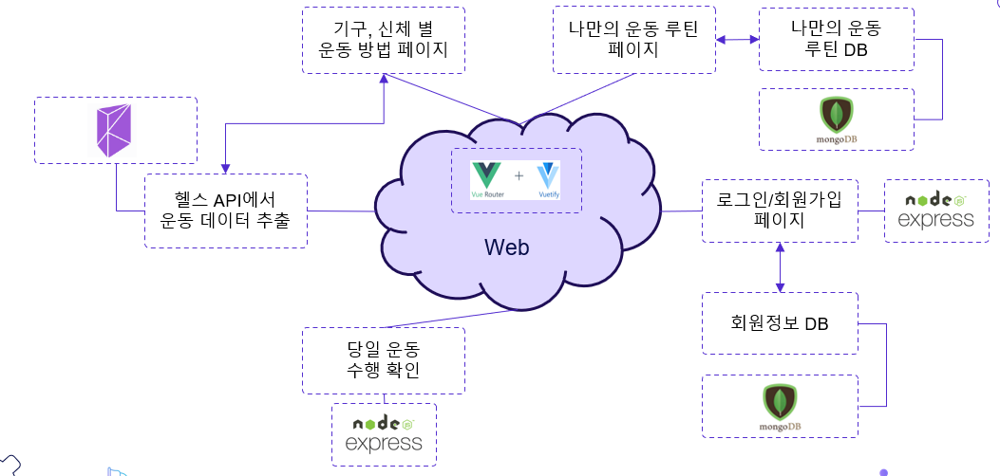
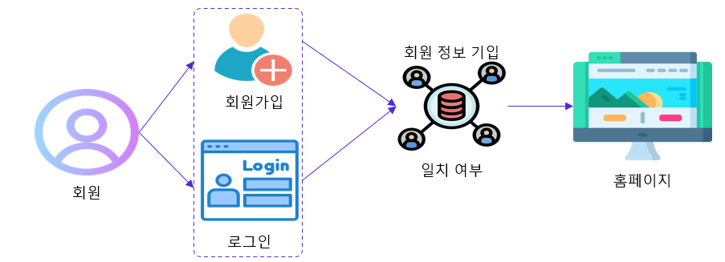

# 프로젝트명
 조아GYM

## 프로잭트 소개
 헬스 사이트로 운동에 대한 추천과 자기만의 운동루틴을 계획할 수 있는 공간을 제공합니다.

## 기능
 * 로그인/회원가입
 * 운동명언 모음(Crwaling)
 * 신체부위별 운동(API)
 * 나만의 운동 루틴 계획(DB, Vuetify)
 * 당일 운동 수행 확인(IOT(Postman), WebSocket)

## 연구방법
 * 브레인스토밍을 통한 아이디어 도출
 * 단점을 보완한 후 장점을 극대화 시키며 편리성을 추가
 * 알고리즘 제작 후 프로그래밍
 * 피드백을 통하여 수정
 * 프로그램 구동 후 테스트를 하며 오류를 수정

## 개발 환경

## 프로그램 통합 구성도

## 실행영상

## 시나리오및 화면 구성
### 로그인/회원가입

### 명언 모음(Crwaling)

### Client와 Server 채팅창

### 주문하는 과정

### 재주문 및 주문내역 취소 과정
#### 클라이언트측에서의 재주문 과정

#### 서버측에서의 주문내역 수정

